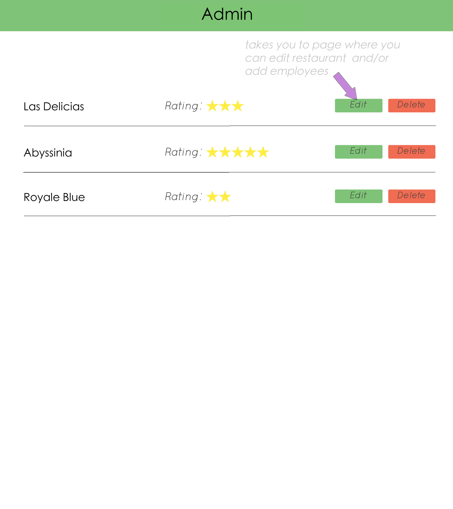

#Going further with restaurants

###Things we learned this week:
  * Joins
  * Migrations
  * Associations
  * Data Modeling
  * Validations
  * Unirest

#Things you will be adding by using these concepts

**!!!!!!! Be sure to read through this whole document, then DATA MODEL your app!
Your data model should be done using draw.io or lucidchart!
Attach a link or screen shot of your data model to your readMe!!!!!!!**

###USER Show page

###ADMIN Show page

### 1. Reviews
* When a user comes to the show page of a restaurant they will see many reviews under the description
* The user has the option to add a new review
* The user can add a review consisting of:
  * Name
  * Date
  * Review
  * Rating of restaurant
  * restaurant association
* The user can post their new review
* The user can go and edit a review
* When the user edits a review, the information should be pre-filled
* The user can delete a review
* The reviews should all occupy the same amount of space on the page ie. Same box size

####Stretch:
* When a user is on the show all restaurants page (index), they can see how many reviews this restaurant has
* When a user sees the overall restaurant rating, it is an average of the ratings of all the reviews
* The reviews are shown as snippets if they are longer than the a lotted space
* The review can be expanded by clicking on the *...* of the snippet

### 2. Employees
* When a user comes to the show one restaurant page, they should be able to add employees
* Employees should have a:
  * First Name
  * Last Name
  * Position (Manager, server, host, chef)
  * restaurant association
* Employees should show up on the show one restaurant page
* The user can edit the employee information
* The user can delete a employee

####Stretch:
* The user can add multiple employees at once
* The User can delete multiple employees at once

### 3. Validations
* The user should be able to enter info about an employee and submits the form.
* The form should not be able to be submitted with blank fields.
* The user should see an error with unique styling when the form is incomplete.
* The user should see specific errors about what is missing in the form.
* The user's form data should persist when the page reloads with errors.

####Stretch
* The user should see an error when a duplicate is submitted
* The error should be specific and say "This *item* already exists!"
